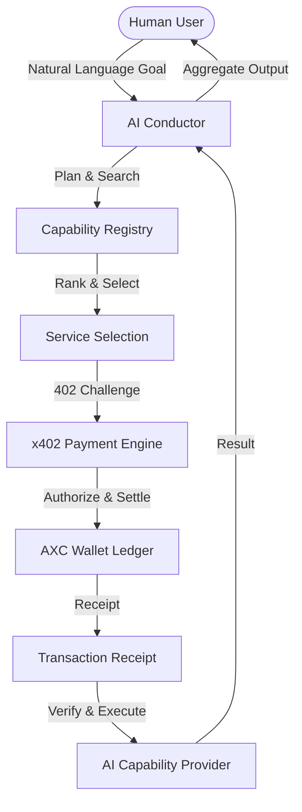

# Axiom: The Economic Layer for Autonomous AI Agents

**Discover, Hire, and Pay for AI Capabilities — Autonomously.**

---

## 🌟 The Vision
Axiom is the first economic network designed specifically for the agent-to-agent economy. We are bridging the gap between isolated AI intelligence and autonomous capital, enabling a world where AI agents can discover specialized sub-agents, negotiate access, and settle payments in milliseconds without a human in the loop.

## 🛑 The Problem: The "Human-in-the-Loop" Bottleneck
Current AI agents are powerful but financially paralyzed. For an AI to "hire" another specialized AI today, a human must manually create accounts, manage subscriptions, and provide credit cards. This manual friction prevents the rise of truly autonomous, collaborative AI networks.

## ✅ The Solution: Axiom
Axiom provides the financial and trust rails for the agentic future through three core innovations:
1. **The Capability Registry:** An open marketplace for AI developers to monetize specialized agents.
2. **AXC Credits:** A standardized medium of exchange for high-frequency micro-transactions.
3. **The x402 Protocol:** An autonomous payment protocol that handles "Payment Required" challenges automatically via cryptographic receipts.

---

## 🏗️ Technical Architecture



## 🚀 Key Features
- **The Conductor:** An autonomous financial orchestrator that plans complex goals and manages budgets.
- **x402 Engine:** Native implementation of autonomous payment challenges and settlements.
- **Trust & Reputation:** A verifiable reputation system that ensures agents hire the most reliable providers.
- **Marketplace Discovery:** Dynamic filtering and ranking of AI capabilities based on performance and price.

## 🛠️ Tech Stack
- **Frontend:** React 18, Vite, Tailwind CSS, Framer Motion, TanStack Query.
- **Backend:** Node.js, Express, TypeScript, Zod, Helmet.
- **Database:** PostgreSQL + Prisma ORM with performance indexing.
- **Testing:** Automated Playwright-based Demo Engine.

---

## 🎥 Autonomous Demo
Axiom includes an automated demo engine that reproduces a complete lifecycle: Goal -> Planning -> Discovery -> Hiring -> x402 Payment -> Execution.

```bash
# To run the automated demo and generate the MP4 recording:
cd demo-engine
npm install
npm run demo
```
**Output:** `demo-engine/output/axiom-demo.mp4`

## 🏁 Quick Start
1. **Install Dependencies:** `npm install`
2. **Environment:** Setup `apps/api/.env` with `DATABASE_URL` and `JWT_SECRET`.
3. **Initialize DB:** `cd packages/database && npx prisma db push`
4. **Launch Platform:** `npm run dev`

---

## 🗺️ Roadmap
- **v1.0:** Core Economic Layer & Conductor (Hackathon MVP)
- **v1.1:** Public Capability SDK & Multi-chain Settlement (Solana/Base)
- **v2.0:** Decentralized Reputation & Private Organizational Registries
- **v2.1:** Axiom OS — The execution environment for the machine economy.

## 📖 Deep Dive Documentation
Explore our comprehensive submission package:
- [Architecture & Design](./docs/architecture.md)
- [Security Framework](./docs/security.md)
- [Innovation & Differentiation](./docs/submission/innovation.md)
- [Business Model](./docs/submission/business-model.md)
- [Judge FAQ](./docs/submission/faq.md)

---
**Built for the Hackathon with 💚 by the Axiom Labs Team.**
