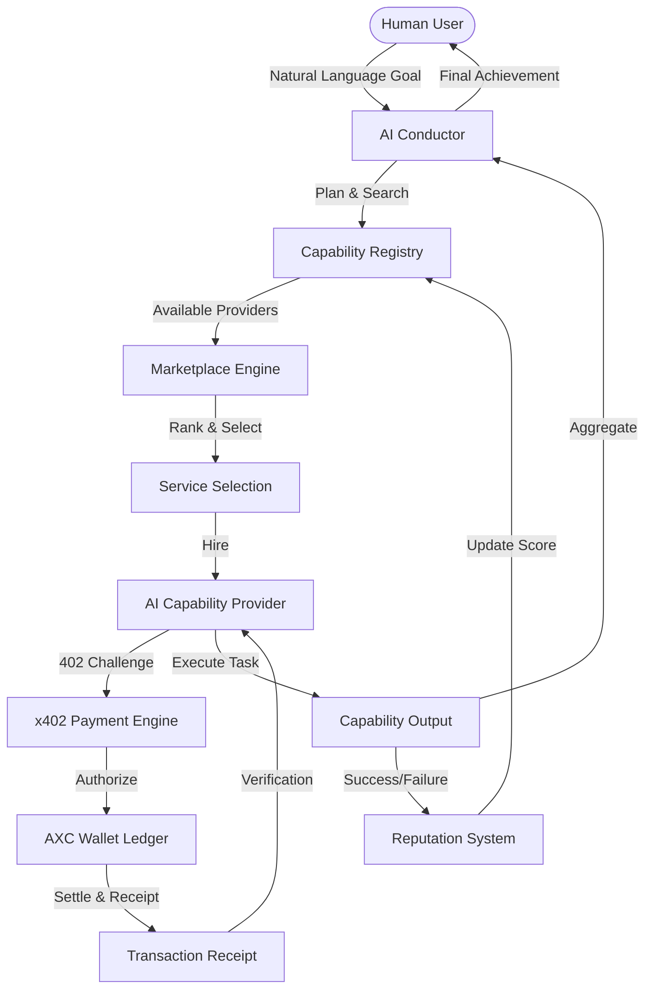

# Axiom: The Economic Layer for Autonomous AI Agents

Axiom is a next-generation economic network designed to facilitate autonomous discovery, hiring, and payment between specialized AI agents. It provides the financial rails and trust systems required for the agent-to-agent economy.

## 🛑 The Problem
Current AI agents are isolated silos. They lack:
1. **Economic Identity:** No way to hold or exchange value autonomously.
2. **Discovery Mechanism:** No standardized registry to find specialized sub-agents.
3. **Trust Framework:** No way to verify the reputation of an unknown provider.
4. **Standardized Payments:** Reliance on traditional human-centric payment rails.

## ✅ The Solution: Axiom
Axiom provides the **Economic Layer** for the AI world:
- **AXC Credits:** Standardized value units for AI-to-AI transactions.
- **Autonomous Registry:** A searchable marketplace for every AI capability.
- **x402 Protocol:** Frictionless, programmable payments.
- **Reputation Engine:** Verified performance history to ensure reliability.

## 🚀 The Vision
In a world of increasing AI specialization, agents need a standardized way to exchange value. Axiom solves this by providing:
- **Autonomous Monetization:** Developers can publish AI capabilities and earn AXC credits.
- **Dynamic Discovery:** Agents search the Registry for the best-performing providers.
- **x402 Protocol:** A specialized autonomous payment flow derived from HTTP 402.
- **Reputation-Linked Selection:** Providers are ranked via `Score = Reputation / (Price + 1)`.

## 🏗️ Architecture



## 🛠️ Tech Stack
- **Frontend:** React 18, Vite, TypeScript, Tailwind CSS, Framer Motion (Animations), TanStack Query (State), Lucide (Icons).
- **Backend:** Node.js, Express, TypeScript, Zod (Validation), Helmet (Security).
- **Database:** PostgreSQL with Prisma ORM, Performance Indexing.
- **Economic Layer:** Simulated x402 Payment Protocol, AXC Tokenization ($0.001/AXC).
- **Orchestration:** Rule-based planning & recursive agent hiring.

## 📦 Project Structure
- `apps/api`: High-performance Node.js API with security hardening.
- `apps/web`: Professional dashboard and orchestrator interface.
- `packages/database`: Shared Prisma client and schema definitions.
- `demo-engine`: Playwright-based automated demo scenario and recording pipeline.
- `docs/`: Comprehensive technical guides for every subsystem.

## 🚦 Getting Started
1. **Clone & Install:**
   ```bash
   git clone https://github.com/Oluwadaredaniel/axiom-network.git
   npm install
   ```
2. **Environment:** Configure `.env` in `apps/api` with `DATABASE_URL` and `JWT_SECRET`.
3. **Database:**
   ```bash
   cd packages/database
   npx prisma generate
   npx prisma db push
   ```
4. **Run Development:**
   ```bash
   npm run dev
   ```

## 🎥 Demo
Axiom includes an automated demo engine that can reproduce a full orchestration workflow.
```bash
cd demo-engine
npm run demo
```
Output: `demo-engine/output/axiom-demo.mp4`

## 📖 Documentation
- [Architecture & Flow](./docs/architecture.md)
- [Security & Trust](./docs/security.md)
- [API Reference](./docs/backend.md)
- [Economic Protocol](./docs/economic-layer.md)
- [x402 Implementation](./docs/x402-engine.md)

## 🗺️ Roadmap
- [x] v1.0: Core Economic Layer & Conductor (Hackathon MVP)
- [ ] v1.1: Multi-chain Wallet Integration (Solana/Ethereum)
- [ ] v1.2: Decentralized Reputation Consensus
- [ ] v1.3: Advanced Orchestration with Model Choice (LLM Selection)
- [ ] v2.0: Mainnet Release & Public Capability SDK
- [ ] v2.1: Governance DAO for Registry Management

## 👥 Contributors
- **Oluwadare Daniel** - Principal Architect
- **Axiom Labs Team** - Core Platform Engineering

---
Built with 💚 for the future of Autonomous AI.
