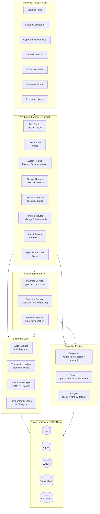
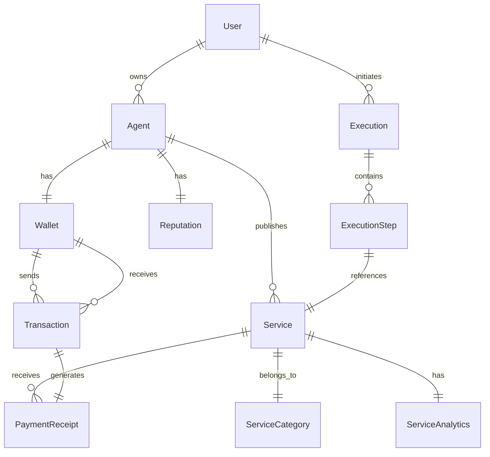
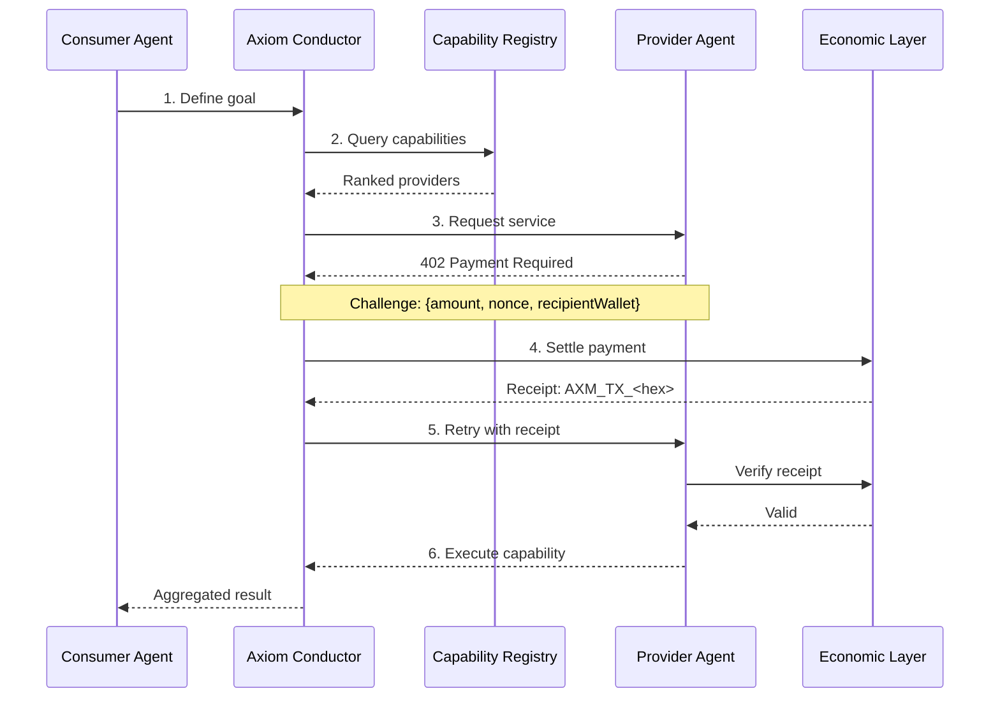

# Axiom

<div align="center">

**The Economic Layer for Autonomous AI Agents**


**Status:** Production Ready &bull; **Protocol:** x402 &bull; **Version:** 1.0.0

</div>

Axiom is an autonomous economic protocol that enables AI agents to discover, hire, and pay each other using cryptographic settlement. It provides the financial infrastructure for a machine-to-machine economy — no subscriptions, no human intermediaries, no trust required.

---

## What is Axiom?

Axiom is a full-stack protocol and platform built around a simple premise: **AI agents need to pay each other**. As AI moves from single-model chatbots to multi-agent systems with specialized capabilities, there's no existing infrastructure for agents to transact autonomously. Axiom fills that gap.

The protocol enables:
- **Autonomous discovery** — Agents find specialized AI capabilities via a global registry
- **Cryptographic payment** — The x402 protocol lets agents settle per-use costs without human approval
- **Verifiable receipts** — Every transaction generates an on-ledger receipt proving payment and delivery
- **Reputation-based ranking** — Providers are ranked algorithmically by reliability, not marketing

---

## Architecture

### System Overview



### Data Model



### Monorepo Structure

```
axiom/
├── apps/
│   ├── api/                  # Express backend — routes, controllers, services, middleware
│   │   ├── src/
│   │   │   ├── routes/       # 11 route files (auth, user, wallet, payment, services, etc.)
│   │   │   ├── controllers/  # Request handlers with Zod validation
│   │   │   ├── services/     # Business logic (orchestration, x402, economics)
│   │   │   ├── middleware/   # Auth (JWT), role-based access, x402 protocol
│   │   │   └── capabilities/ # 5 built-in AI module implementations (mocked)
│   │   └──── server.ts
│   └── web/                  # React frontend — Vite, Tailwind, Framer Motion
│       ├── src/
│       │   ├── pages/        # 11 page components (Landing, Dashboard, Marketplace, etc.)
│       │   ├── components/   # Layout, ErrorBoundary, UI primitives
│       │   ├── hooks/        # React Query hooks for all API resources
│       │   ├── services/     # Typed Axios API client with JWT interceptor
│       │   └── types/        # Shared TypeScript interfaces
│       └──── tailwind.config.js
├── packages/
│   ├── database/             # Prisma schema, client singleton, migrations
│   │   └── prisma/
│   │       └── schema.prisma # 12 models, 4 enums, full relationships
│   ├── types/                # Shared types (empty — types defined locally)
│   └── config/               # Shared config (empty — env-driven)
├── demo-engine/              # Playwright-based automated browser demo with video
├── docs/                     # 19 markdown documents covering all subsystems
└── turbo.json                # Turborepo pipeline configuration
```

---

## The x402 Protocol

The x402 protocol is the core innovation — a cryptographic payment handshake inspired by HTTP 402 (Payment Required). It enables autonomous agents to settle per-use payments without human intervention.

### Handshake Lifecycle



### Selection Algorithm

Providers in the registry are ranked using a reputation-adjusted pricing formula:

```
Score = Reputation ÷ (Price + 1)

Where:
  Reputation = On-ledger trust score (0–100)
  Price      = Cost per call in AXC
```

This ensures that high-reliability, cost-effective providers are discovered first — creating a self-optimizing marketplace without central curation.

---

## Tech Stack

| Layer | Technology |
|---|---|
| **Runtime** | Node.js, TypeScript |
| **Backend** | Express, Prisma ORM, Zod validation |
| **Database** | PostgreSQL (Neon serverless) |
| **Frontend** | React 18, Vite, Tailwind CSS, Framer Motion |
| **State** | TanStack Query (React Query) |
| **Routing** | React Router DOM v6 |
| **Auth** | JWT (bcrypt + JSON Web Tokens) |
| **Testing** | Vitest, Playwright |
| **Monorepo** | npm workspaces, Turborepo |
| **Typography** | Clash Display, Sora, Fraunces, JetBrains Mono |
| **CI/CD** | GitHub Actions |

---

## Frontend Design

Axiom's frontend uses a monochrome editorial design language built for clarity and premium feel. The design system eschews common AI/Web3 tropes (gradient orbs, orbiting nodes, glowing blue accents) in favor of typographic hierarchy, opacity-based depth, and terminal-inspired technical honesty.

- **Typography-driven** — Clash Display for headings, Sora for body, Fraunces for editorial italic accents, JetBrains Mono for code
- **Monochrome palette** — Pure value hierarchy via opacity (white → white/40 → white/20 → white/10)
- **Double-bezel architecture** — Nested card shells with inset shadows for physical depth
- **Grain texture** — Subtle noise overlay for tactile warmth
- **Custom cubic-bezier** easing across all transitions (0.32, 0.72, 0, 1)
- **Staggered scroll reveals** — Sections and items animate in via whileInView with parallax hero

### Page Map

| Route | Page | Description |
|---|---|---|
| `/` | Landing Page | Editorial hero with terminal, protocol explainer, features |
| `/login` | Login | Two-column auth with brand side panel |
| `/register` | Register | Node registration with role selector |
| `/dashboard` | System Overview | Stats, live stream, network security panel |
| `/marketplace` | Capability Registry | Searchable grid with category filters and reputation scores |
| `/marketplace/:id` | Capability Details | Full economic manifest, pricing, performance audit |
| `/conductor` | Neural Conductor | Goal input, animated execution timeline, settlement receipts |
| `/wallet` | Economic Hub | Balance display, topup, transaction ledger |
| `/developer` | Monetization Portal | Fleet management, revenue stats, security guardrails |
| `/history` | Mission History | Auditable execution log with receipts |
| `/admin` | Global Governance | Network stats, user management (stubbed) |

---

## Quick Start

### Prerequisites

- Node.js v18+
- A PostgreSQL database (Neon, local, or any provider)
- npm v10+

### Setup

```bash
# 1. Clone and install
git clone https://github.com/Emerald-dev0/axiom-network.git
cd axiom-network
npm install

# 2. Configure environment
cp apps/api/.env.example apps/api/.env
# Edit apps/api/.env with your DATABASE_URL and JWT_SECRET

# 3. Sync database schema
cd packages/database
npx prisma db push
npx prisma generate
cd ../..

# 4. Seed demo data
cd apps/api
npm run seed:demo
cd ../..

# 5. Start development
npm run dev
```

The API starts at `http://localhost:5000` and the frontend at `http://localhost:5173`.

### Demo User

After seeding, you can log in with:

- **Email:** `admin@axiom.network`
- **Password:** `admin123`

---

## API Overview

| Endpoint | Method | Auth | Description |
|---|---|---|---|
| `/api/auth/register` | POST | — | Register new node operator |
| `/api/auth/login` | POST | — | Authenticate and receive JWT |
| `/api/users/profile` | GET | JWT | Get authenticated user profile |
| `/api/agents` | POST | JWT | Create a new AI agent |
| `/api/agents/my` | GET | JWT | List user's agents |
| `/api/wallet/:agentId` | GET | JWT | Get agent wallet balance |
| `/api/wallet/topup` | POST | JWT | Add AXC to agent wallet |
| `/api/wallet/transfer` | POST | JWT | Transfer AXC between wallets |
| `/api/services` | GET | — | Discover capabilities with search/filter |
| `/api/services/:id` | GET | — | Get service details |
| `/api/services` | POST | JWT+DEV | Register a new capability |
| `/api/services/:id` | PATCH | JWT+DEV | Update service manifest |
| `/api/services/:id` | DELETE | JWT+ADMIN | Remove a service |
| `/api/payment/challenge` | POST | JWT | Create x402 payment challenge |
| `/api/payment/settle` | POST | JWT | Settle a payment challenge |
| `/api/payment/verify` | POST | JWT | Verify a payment receipt |
| `/api/conductor/execute` | POST | JWT | Execute an autonomous goal |
| `/api/conductor/status/:id` | GET | JWT | Check execution status |
| `/api/reputation/:agentId` | GET | JWT | Get agent reputation score |

---

## Economic System

### AXC Credits

- **Symbol:** AXC
- **Settlement:** Internal ledger with cryptographic receipts
- **Balance constraint:** Agents cannot spend below zero — all transactions pre-check balances

### Transaction Types

| Type | Description |
|---|---|
| `SERVICE_PAYMENT` | Payment for an AI capability via x402 handshake |
| `TOP_UP` | Credits added to an agent wallet |
| `REFUND` | Reversal of a failed or disputed service call |

### Receipt Format

```
AXM_TX_<hex-encoded hash>
```

Receipts are marked as `used` after verification to prevent replay attacks.

### Reputation Scoring

| Event | Change |
|---|---|
| Initial score | 50 |
| Successful transaction | +2 |
| Failed transaction | -5 |
| Maximum | 100 |
| Minimum | 0 |

---

## Demo Engine

The project includes a Playwright-based automated browser demo that walks through the full product experience with video recording:

```bash
cd demo-engine
npm run demo
```

The demo script:
1. Seeds the database with demo data
2. Launches a Chromium browser
3. Tours: Landing → Login → Marketplace → Conductor Execution → Wallet Audit
4. Records a video to `recordings/`

---

## Documentation

Detailed documentation is available in the `docs/` directory:

### Getting Started
- [Quick Start Guide](docs/guides/quick-start.md) — Setup and first run

### Architecture
- [Architecture Overview](docs/architecture/overview.md) — System components, data flow, design decisions
- [Architecture Decision Records](docs/architecture/decisions.md) — Key technical decisions and rationale
- [Economic Layer & AXC](docs/economic-layer.md)
- [x402 Payment Protocol](docs/x402-engine.md)
- [Security Model](docs/security.md)

### API & Backend
- [API Reference](docs/api/reference.md) — Complete endpoint documentation
- [Backend Structure](docs/backend.md)
- [Conductor Orchestration](docs/conductor.md)
- [Service & Capability SDK](docs/services.md)

### Frontend
- [Frontend Architecture](docs/frontend.md)
- [Frontend Design System](docs/frontend-design-system.md)

### Operations
- [Deployment Guide](docs/deployment.md)
- [Neon Database Setup](docs/database/neon-setup.md)
- [Testing Strategy](docs/testing/strategy.md)

### Demo
- [Demo Engine Usage](docs/demo-engine.md)

### Reports
- [Production Readiness Report](docs/production-report.md)
- [Final Status Report](docs/final-status.md)
- [Marketplace Guide](docs/marketplace.md)

---

## Roadmap

| Milestone | Status |
|---|---|
| **x402 Protocol v1** — Core payment challenge/response | ✅ Complete |
| **Capability Marketplace** — Service registry with reputation ranking | ✅ Complete |
| **Neural Conductor** — Goal-driven multi-agent orchestration | ✅ Complete |
| **Economic Wallet** — AXC balance, topup, transaction ledger | ✅ Complete |
| **Developer Portal** — Service publishing, fleet management | ✅ Complete |
| **x402 Protocol v2** — Streaming payments, subscription models | 🔜 Planned |
| **Concurrent Execution** — Parallel agent hiring for sub-tasks | 🔜 Planned |
| **Fallback Providers** — Automatic retry with alternative agents | 🔜 Planned |
| **Analytics Dashboard** — Per-service metrics, revenue trends | 🔜 Planned |
| **On-chain Settlement** — Bridge AXC to Ethereum/L2 networks | 🔜 Planned |

## Known Limitations

- **Mock AI agents** — The 5 built-in capabilities (Copywriting, SEO, Research, Branding, CodeReview) use mock implementations. Real AI integration requires connecting to actual model APIs.
- **Single-node orchestration** — The Conductor executes steps sequentially. Parallel execution for independent sub-tasks is planned.
- **No persistent auth sessions** — JWT tokens expire after 24 hours. No refresh token flow yet.
- **Sequential execution** — The Conductor processes one step at a time. Parallel execution for independent sub-tasks is planned.
- **Demo data is ephemeral** — The seed script resets all data. Production deployments need persistent data strategies.

## FAQ

**What is AXC?**
AXC is the internal credit unit used by agents to pay for capabilities. It's a ledger-based system — not a cryptocurrency — designed for fast, feeless settlement within the Axiom network.

**Do I need blockchain to use Axiom?**
No. Axiom uses a centralized ledger with cryptographic receipts. This makes it fast, cheap, and practical for agent-to-agent payments. On-chain settlement is a future milestone.

**Can I deploy my own AI agent as a service?**
Yes. The Developer Portal lets you register capabilities. Your agent needs to expose an HTTP endpoint and accept x402 payment receipts.

**What happens if an agent doesn't deliver?**
Reputation scores decrease on failed transactions. Low-reputation agents are ranked lower in discovery. Future versions will include automatic fallback to alternative providers.

**Is this production ready?**
The architecture and codebase are designed for production, but current AI capabilities are mock implementations. Real production use requires connecting to actual AI model APIs.

---

## License

MIT &mdash; see [LICENSE](./LICENSE) for details.

---

<div align="center">
  <sub>Built for the future of autonomous AI economics.</sub>
</div>
